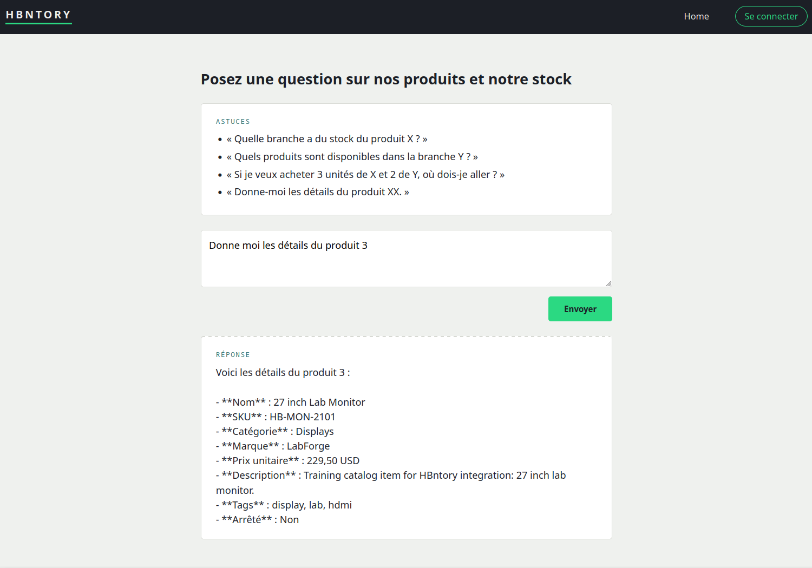
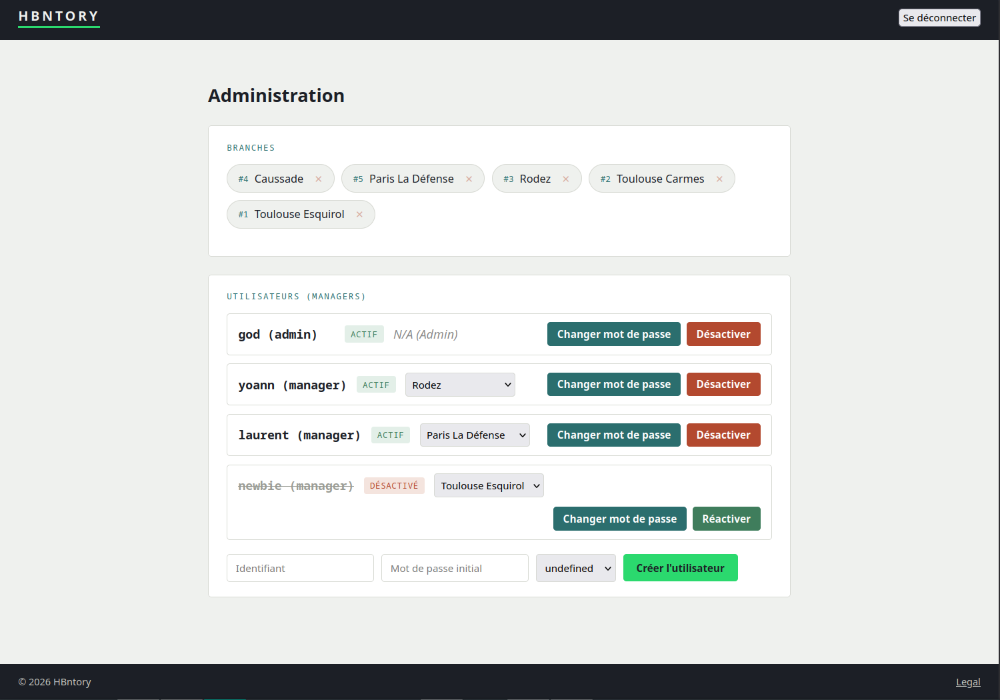
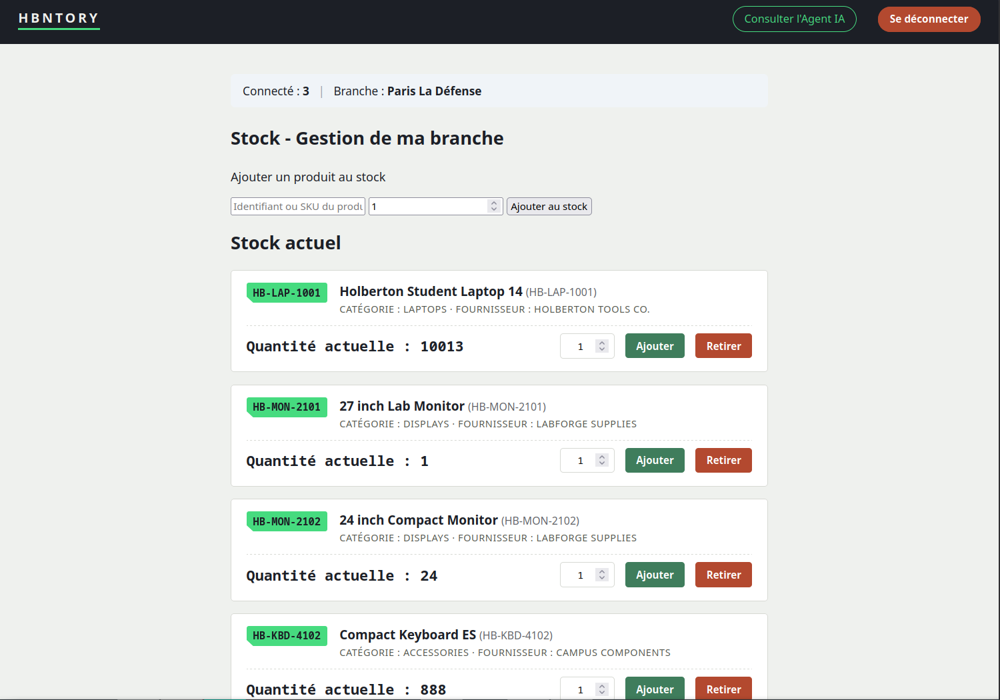
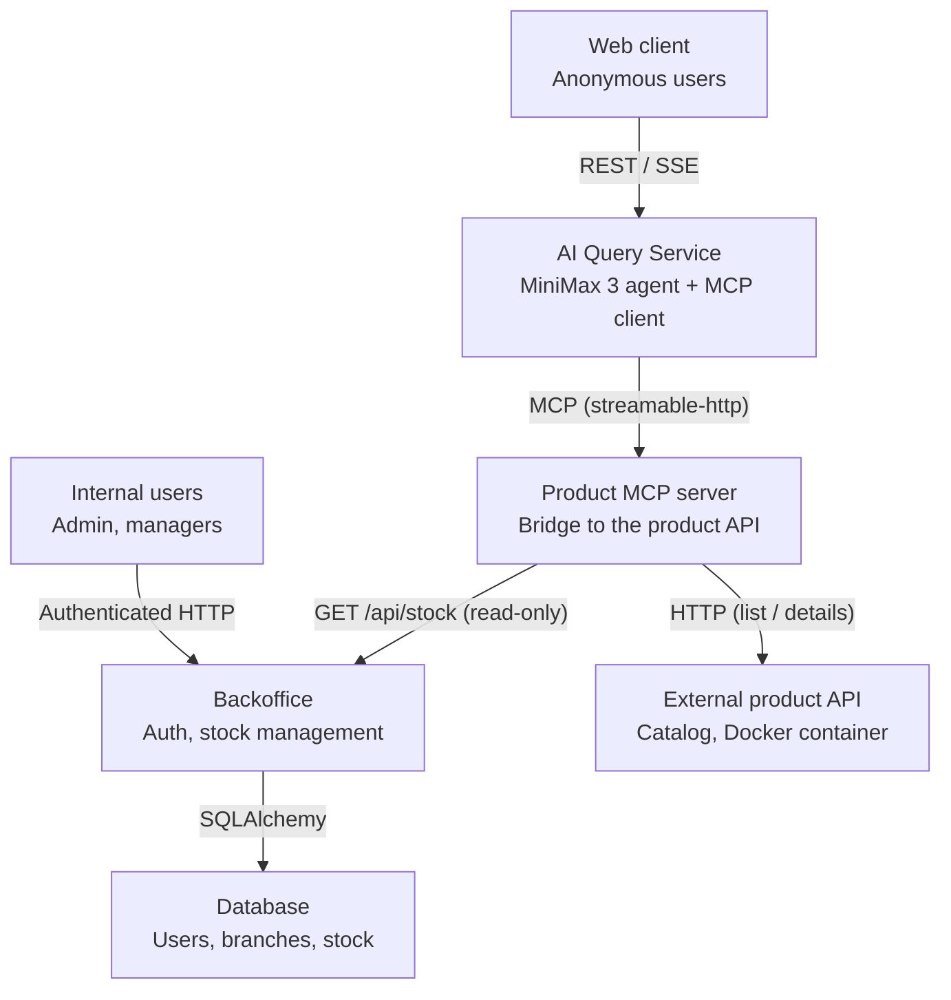
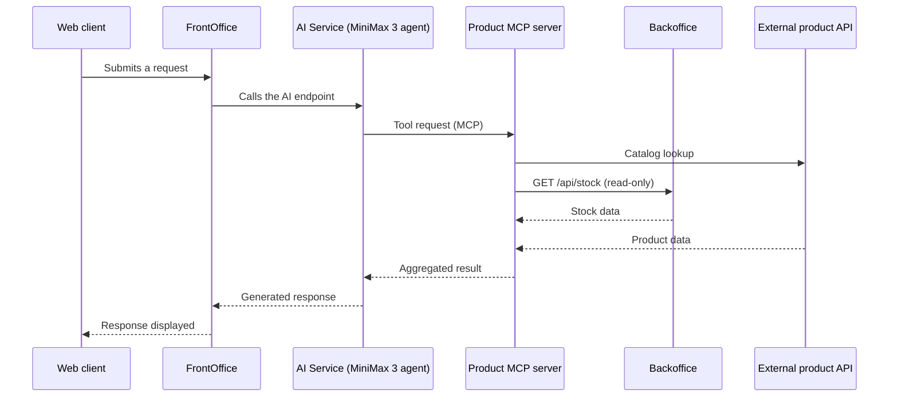
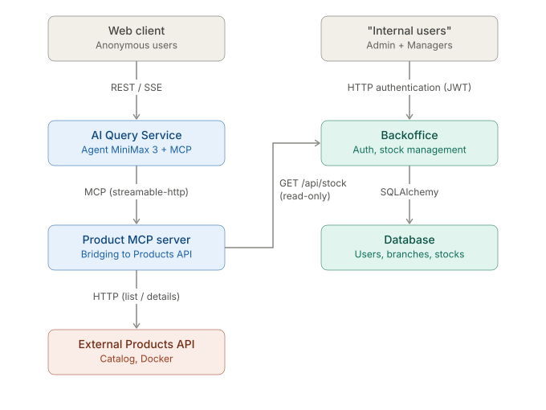

# Holberton Inventory - A proof-of-concept of full-fledged application

## Summary

<details>
<summary><b>Table of Contents (Click to expand)</b></summary>

- [Summary](#summary)
- [How to install and run](#how-to-install-and-run)
  - [Prerequisites](#prerequisites)
  - [Configuring and running](#configuring-and-running)
- [How to use](#how-to-use)
  - [Starting program](#starting-program)
  - [Usage overview](#usage-overview)
- [Features and limitations](#features-and-limitations)
  - [Supported (v1.0)](#supported-v10)
  - [Not Supported (yet) & Known Limitations](#not-supported-yet--known-limitations)
- [Examples of use](#examples-of-use)
  - [Valid examples](#valid-examples)
  - [Failing examples](#failing-examples)
- [Technical information](#technical-information)
  - [General architecture](#general-architecture)
    - [Core design principles](#core-design-principles)
    - [Main code structuration](#main-code-structuration)
  - [Technical stack overview](#technical-stack-overview)
  - [Communications overview](#communications-overview)
  - [Process Flow for a request from end-user](#process-flow-for-a-request-from-end-user)
    - [Backoffice...](#backoffice)
    - [Frontoffice](#frontoffice)
  - [Architecture macro diagram](#architecture-macro-diagram)
  - [Memory management & Performance](#memory-management--performance)
- [Testing](#testing)
- [Project constraints and methodology](#project-constraints-and-methodology)
  - [Imposed constraints](#imposed-constraints)
    - [Requirements](#requirements)
  - [Project methodology](#project-methodology)
  - [Acknowledgments](#acknowledgments)
- [Technologies Used](#technologies-used)
- [Authors](#authors)
- [License](#license)

</details>

</details>

## How to install and run

<details>
<summary>(Click for detailed information on prerequisites, download and installation/configuration/run steps)</b></summary>

### Prerequisites

To run the Hbntory platform, **Docker** and **Docker Compose** are the only core system requirements. Because all services (Backoffice API, External Products API, MCP Server, AI Service, and Frontend) are fully containerized, you do not need to install Python, MySQL, or Node.js locally on your host system.

Note however that if you want to run our integrated test suite locally or just want to run components without the whole Docker abstraction you'll need Python3 installed (you can refer to this [third-party tutorial](https://realpython.com/installing-python/)) along with all the libraries listed in the individual requirements (to have a list quickly, from a shell like Bash opened in project root you can run `find . -type f -name "requirements.txt" -exec cat {} + | tr -d '\r' | grep -v '^#' | sort -u`). Then just install them with pip.

#### Additional Requirements:
- **Git**: To clone the project repository.
- **Modern Web Browser**: Chrome, Firefox, Edge, or Safari to access the Backoffice Web UI and AI Client.


#### Installing Docker on your OS

##### Windows 10
1. Download and install **[Docker Desktop for Windows](https://docs.docker.com/desktop/setup/install/windows-install/)**.
2. During installation, make sure the **Use WSL 2 instead of Hyper-V** option is checked.
3. Restart your computer after installation completes.

##### Windows Subsystem for Linux (WSL / WSL 2)
1. Install Docker Desktop on Windows (as described above).
2. Open Docker Desktop, navigate to **Settings > Resources > WSL Integration**.
3. Toggle the switch to enable integration for your installed Linux distribution (e.g., Ubuntu).
4. Open your WSL terminal; `docker` and `docker compose` will now be available directly.

##### Debian-based Linux (Ubuntu, Debian, Mint)
Run the following commands in your terminal:
```bash
sudo apt update
sudo apt install -y docker.io docker-compose-v2
sudo systemctl enable --now docker
sudo usermod -aG docker $USER
# Note: Log out and log back in for the group membership change to take effect.
```

##### Arch-based Linux (Arch Linux, Manjaro)
```
sudo pacman -Syu docker docker-compose
sudo systemctl enable --now docker
sudo usermod -aG docker $USER
# Note: Log out and log back in for the group membership change to take effect.
```

### Configuring and running

Hbntory uses Docker Compose to orchestrate all microservices. Configuration is driven entirely through environment variables defined in a `.env` file at the root of the repository.

#### Step 0: Retrieving project files

If you have Git it is very quick and easy: open a shell like Bash where you want project to sit then type those commands.
```
git clone https://github.com/llacote-holberton/holberton_inventory.git
cd holberton_inventory
```

Alternatively you can just download the [latest release zip](https://github.com/llacote-holberton/holberton_inventory/archive/refs/heads/main.zip) and extract it in your favorite file explorer then open the holberton_inventory.


#### Step 1: Environment Configuration (one-shot)

Copy the provided `.env.example` file to create your local `.env` configuration:

```bash
cp .env.example .env
# If you want to edit in command line with vim
vim .env
```
Open with your favorite GUI text editor and adjusted the required values.

##### WARNING about CRITICAL CONFIGURATION VALUES
Before launching the stack, you must update the following placeholder values in your .env file:
- DB_ROOT_PASSWORD & DB_HBNTORY_USER_PWD: change these from the default placeholders to secure passwords.
- INTERNAL_API_KEY: security key used by the MCP Server to communicate with the Backoffice API.
  You can generate a secure random string using Python if you have it installed:  
  `python3 -c "import secrets; print(secrets.token_urlsafe(32))"`
- JWT_SECRET: used by the Backoffice API to sign authentication tokens.
  Generate a unique secret string using the same command above.
- LLA_MODEL_NAME: provide here a "machine name" for the desired model. NOTE that by default the model is Nvidia's minmax3, which will require you to create a (free) access and related API Key. Confer https://platform.minimax.io/docs/guides/quickstart-preparation.
- LLM_MODEL_API_KEY: provide your API key for the configured LLM provider

For more information on LLM configuration specifically, please confer the [Annex 1: choosing your LLM model](docs/ANNEX-1.md).


# Step 2: Managing the environment (repeatable)

NOTE: all the following commands expect you to run them from the project's root so the 'compose' command automatically finds the related docker-compose.yml file.
Otherwise you will need to specify the path to the compose file.

## Starting
To build all container images and start all microservices, run:
`docker compose up -d --build`

*Warning* please note that if you choose a local agent, for now you will need to manually ask the service to pull your chosen model (ex for ornith) AFTER all services are up and running.
`docker compose exec -t "ollama" ollama pull "ornith"`

**IMPORTANT** as project uses community provided images AND a public Github repository for one service (products-api), a working network connexion allowing access to internet is required whenever you use the option --build (and a decent bandwith like >=1.5Mo sec is recommended).

What does it do?
- docker: name of the "containarization tool" which allows you to create and run apps and operating systems in a total isolation.
- compose: one of the first level commands of docker: instructs it to find file(s) with specific name(s) in current filetree and parse them to get a series of instructions to create several "containers" lumped together. Here it will automatically target the "docker-compose.yml"
- '--build': forces the composition process to double-check the files which define how each container should be created, and (re)create them if need be.
- '-d': means "detached mode", aka the compose process will tell you about what it is doing on the terminal while working but when finished will "give terminal back to you". Without this option, the terminal would be "locked" to show runtime information. Which is a mode usually kept for debugging.

## Monitoring

You can check the status of all running containers at any time with:
`docker compose ps` (ps standing for "process status")
You can also check the logs of the containers by doing the following command, with or without a service name as parameter.
`docker compose logs <optional:name-of-service-as-defined-in-compose-file>`

Finally, you can monitor the live real-time memory and CPU consumption of all running containers across your Hbntory stack by executing:
```
docker compose stats
```
Or just a snapshot of it at given time with `--no-stream` option added (`docker stats --no-stream`).


## Stopping
To stop the stack without losing any information, just run this.
`docker compose down`.

## Deleting all information (containers AND database)

If you want to completely and cleanly uninstall this project (or just restart it from scratch), you can simply do `docker compose down -v`. The -v option means "Volume deletion" and implies that the persistent storage for database will be deleted from your machine.

</details>

## How to use

### Starting program

Considering you fulfilled all preparation steps (confer above section) just this is enough, at project's root: `docker compose up --build -d`.
This command starts all the containers: the MariaDB database, the external product API, the BackOffice, the FrontOffice, and the AI Service.
Once the containers are running, the application is accessible via:
- the BackOffice HTML interface, for internal users (admin / managers) (by default at url http://localhost:8000)
- the FrontOffice interface, for anonymous customers, which triggers the AI agent when the submit button is clicked (by default at http://localhost:8080)


### Usage overview

On the Frontoffice side, the customer submits a request through the FrontOffice; it is forwarded to the AI Service, which relies on an agent (MiniMax 3) querying an MCP server to fetch produc
t/stock information from the BackOffice and the external product API, then returns a response to the customer.

<details><summary>Client UI sneak peek</summary>
<p align="center">
  
</p>
</details>

For concrete examples, see [Examples of use](#examples-of-use).

On the BackOffice side, Admin takes care of creating Managers and assigning them to a branch, then those Managers manage stock (CRUD) via the HTML interface or the dedicated REST API, with real-time updates pushed to other sessions via Server-Sent Events.

As the interface is pretty much self-explanatory, examples are not provided, discover and enjoy it by yourself!
Just note two important limitations: per business requirements users and branches cannot be deleted from interface, you'll need someone who knows how to write SQL instructions through mariadb utility.

<details><summary>Client UI sneak peek</summary>

<p align="center">
  
  
</p>


</details>


## Features and limitations

As this project was built under tight time constraints and with a pedagogical focus first, it remains intentionally simple in scope.

### Supported (v1.0)

Functional features overview:
- Per-branch stock management (viewing, updating) with a non-negative quantity constraint
- Real-time stock updates on the BackOffice side via Server-Sent Events
- Internal user authentication with two roles: `admin` and `manager`
- Product lookup by an AI agent (MiniMax 3) via a dedicated MCP server
- Product catalog lookup via a containerized external API

#### Multi-Branch & Inventory Core Management
- **Branch-Specific Stock Tracking**: Manage and inspect stock quantities independently per physical or virtual store branch.
- **Atomic Stock Adjustments**: Fast and secure addition and removal of stock items with built-in validation (e.g., preventing negative inventory balances).
- **Product Catalog Integration**: Seamless integration with external product reference APIs, supporting instant lookups by numeric Product ID or alphanumeric SKU.
- **Discontinued Item Protection**: Automatic validation preventing stock additions for phased-out catalog items while preserving existing inventory records.

#### Real-Time Synchronization (Server-Sent Events)
- **Live UI Updates**: Pub/Sub architecture built with Python `asyncio.Queue` streaming stock modifications live via **Server-Sent Events (SSE)**.
- **Zero-Polling Reactivity**: Connected Manager dashboards dynamically update quantities and alert visual states across open browser sessions in real-time without full page refreshes.

#### Security & Role-Based Access Control (RBAC)
- **JWT Authentication**: Stateless authentication issuing signed JSON Web Tokens (`/login`, `/whoami`).
- **Strict Role Isolation**:
  - **Admin**: Full access to global user management (create, activate/deactivate, reset passwords), global branch listing, and manager assignments.
  - **Manager**: Strict scope isolation enforcing access exclusively to their assigned branch's stock data.
- **Inter-Service Authentication**: Protected internal API communication secured with static API key headers (`X-API-KEY`) between the MCP Server and Backoffice.

#### AI Assistant & Model Context Protocol (MCP) Integration
- **Natural Language Inventory Queries**: Chat-based AI assistant capable of answering complex inventory questions and executing stock checks using natural language.
- **FastMCP Integration**: Custom MCP server exposing structured **Tools** (`get_stock`, `list_branches`, `get_all_branch_stocks`) and **Resources** (`inventory://catalog-summary`) directly to the LLM agent.
- **Multi-LLM Provider Support**: Powered by LiteLLM / Google ADK, allowing seamlessly swapping between 100+ LLMs (OpenAI, Google Gemini, Anthropic, NVIDIA NIM, Groq, local Ollama, etc.) via simple environment configuration.

#### Containerized Architecture & Portability
- **Fully Orchestrated Stack**: 6-container Docker Compose setup (`stocks-db`, `products-api`, `internal-api`, `backoffice`, `mcp-server`, `ai-service`, `web-client`).
- **Database Abstraction**: MariaDB relational backend for persistent production storage paired with SQLAlchemy ORM for test portability.


### Not Supported (yet) & Known Limitations

As Hbntory was designed and built within tight time constraints as a pedagogical proof-of-concept, certain trade-offs and architectural compromises were made.


#### AI Assistant & MCP Integration
- **Stateless Chat Session**: The AI agent currently operates statelessly—each request is processed independently without conversational memory. Complex multi-turn follow-up queries (e.g., *"Which computers are in Toulouse?"* followed by *"What about Paris?"*) are not supported natively yet.
- **Partial Entity Enrichment in Bulk Queries**: Large-scale summary queries (like fetching the full multi-branch catalog) rely heavily on raw database IDs. The AI agent may return list outputs containing Product IDs without automatically cross-referencing names and supplier details for every single item.
- **Model-Dependent Performance**: AI response latency, reasoning quality, and tool-calling execution accuracy are strictly bound to the capabilities of the selected LLM (e.g., lightweight local models vs. commercial frontier models).


#### Architecture & Real-Time Engine
- **Single-Node Pub/Sub Scope**: The real-time SSE engine relies on Python's in-memory `asyncio.Queue` within a single process. It does not support horizontal scaling across multiple Backoffice API instances (which would require a distributed broker like Redis Pub/Sub or RabbitMQ).
- **Resource Footprint**: Running 6 microservice containers simultaneously requires a moderately powerful host machine (recommended: at least 4GB of free RAM and multi-core CPU).


#### Security & Production Readiness
- **Proof-of-Concept Security Model**: While basic JWT authentication, RBAC, and API keys are implemented, the overall system has not undergone security audits. Potential production vulnerabilities remain open (e.g., unencrypted HTTP between internal container networks, lack of request rate-limiting/throttling, and basic CORS policies).
- **Database Schema Lifecycle**: Database initialization relies on raw static `.sql` scripts. There is currently no database migration tool integrated (such as Alembic) to handle dynamic schema evolution.


#### Testing & Code Coverage
- **Incomplete Backend Test Suite**: Endpoints and features developed in later phases (e.g., recent user management and stock assignment endpoints) currently lack full unit and integration test coverage.
- **Absence of Front-End Automation**: The HTML5/Vanilla JS frontend has no automated end-to-end (E2E) or component testing suite (e.g., Cypress, Playwright, or Jest).
- **No Automated LLM Benchmarking**: Evaluation of AI tool-calling reliability and response safety is currently done through manual prompt testing.


## Examples of use

<details>
<summary>(Click to expand)</b></summary>

### Valid examples

#### Getting information on a specific product (per id or sku) in various languages

Question: `Donne moi les détails du produit 3` | `Donne moi les détails du produit HB-MON-2101`
Answer:
```
Voici les détails du produit 3 | HB-MON-2101:

- **Nom** : 27 inch Lab Monitor
- **SKU** : HB-MON-2101
- **Catégorie** : Displays
- **Marque** : LabForge
- **Prix unitaire** : 229,50 USD
- **Description** : Training catalog item for HBntory integration: 27 inch lab monitor.
- **Tags** : display, lab, hdmi
- **Arrêté** : Non
```

Question: `Give me all informations about HB-MON-2101`
Answer:
```
Here are all the details for **HB-MON-2101**:

- **Name:** 27 inch Lab Monitor
- **Description:** Training catalog item for HBntory integration: 27 inch lab monitor.
- **Category:** Displays
- **Brand:** LabForge
- **Unit Price:** $229.50 USD
- **Discontinued:** No
- **Tags:** display, lab, hdmi
- **Product ID:** 3
```

Question: `Gib mir alle Informationen zu HB-MON-2101.`
Answer:
```Hier sind alle Informationen zum Produkt **HB-MON-2101**:

- **Name:** 27 inch Lab Monitor
- **SKU:** HB-MON-2101
- **Kategorie:** Displays
- **Marke:** LabForge
- **Preis:** 229,50 USD
- **Beschreibung:** Training catalog item for HBntory integration: 27 inch lab monitor.
- **Tags:** display, lab, hdmi
- **Eingestellt:** Nein`
```

NOTE: only western languages are correctly supported. Questions made in other languages like arabic or asian ones (ex `HB-MON-2101に関するすべての情報を教えてください`) have a high probability of ending up with answers in agent's default language aka French.

### Questions about stocks for a product or a branch

Question: `Give me all products available in Toulouse Esquirol branch`
Anwser:
```
Here are the products available in the **Toulouse Esquirol** branch:

| SKU | Product | Quantity | Unit Price |
|---|---|---|---|
| HB-MON-2102 | 24 inch Compact Monitor (LabForge) | 15 | $169.99 |
| *(unknown)* | Product ID 666 | 45 | — |

Note: The product with ID 666 could not be retrieved from the catalog (it appears to be missing or invalid), so its details are unavailable.
```

Question: `Give me all stocks availability across all branches for HB-MON-2102`
Answer
```
Here are the stock availability details for **HB-MON-2102** (24 inch Compact Monitor):

| Branch ID | Quantity |
|-----------|----------|
| 1 | 15 |
| 2 | 8 |
| 5 | 24 |
| **Total** | **47** |
```

Question: `Give me all stocks everywhere`
Answer:
```
Here are all the stocks across the network:

**Caussade (branch 4)**
- Produit #2: 777
- Produit #6: 0

**Paris La Défense (branch 5)**
- Produit #1: 10,013
- Produit #3: 1
- Produit #4: 24
- Produit #7: 888
- Produit #18: 29
- Produit #32: 2
- Produit #35: 65
- Produit #666: 1

**Rodez (branch 3)**
- (no stock)

**Toulouse Carmes (branch 2)**
- Produit #4: 8

**Toulouse Esquirol (branch 1)**
- Produit #4: 15
- Produit #666: 45
```


### Mixed questions
Question: `If I want to buy 3 HB-MON-2102 and as many HB-KBD-4102, which branches should I visit? `
Answer: `To buy 3 units of HB-MON-2102 and as many HB-KBD-4102 as possible, you should visit **branch 5**, which has 24 monitors and 888 keyboards in stock — more than enough for both items in one stop.`

### Failing examples

The AI Agent is configured to only process questions directly related to stocks and products. Anything beyond will result in a polite refuse or plain incapability to give pertinent answers.

Couple of use-cases which are not supported.
`What is the current weather in Toulouse?`
`Give me the winning numbers on the next French National Lottery.`


-> `I'm having trouble understanding your question, could you clarify please?`


</details>

## Technical information

This section only present the high-level information. For more details on technical choices and in-depth explanations please confer our dedicated [Architecture](./docs/ARCHITECTURE.md) page.

### General architecture

#### Core design principles

The project relies on following core principles.

1/ Business data is split in two parts: a catalog of products provided by a third party, exposed through an API; and a database managed by identified humans to affect stocks of products available for selling in various stores (named "branches").

2/ The "end-user" part only exposes an Agent dedicated to answering questions about products and stocks by relying on a middleware "preparing answers" for it (no global data access). This way the manipulations of actual business data is strictly gated, limiting security risks at least from that channel.

3/ The custom components are all made in Python to simplify the maintenance and evolution of the project.

4/ As this application as a whole requires several components to run on a group of ports, it provides a Docker composition file to provide a quick & easy way to set up all services in a cohesive way.

#### Main code structuration

The project is built around three main components:
- **BackOffice** — the sole source of truth for product and stock knowledge, for both internal users (HTML interface) and the AI agent. Relies on an ORM interface for
 CRUD operations, an HTTP client to the external product API, and an HTTP server exposing HTML pages, REST endpoints, and an SSE stream.
- **FrontOffice** — the sole entry point for anonymous visitors; it never talks directly to the BackOffice, only through the AI Service.
- **AI Service** — the bridge between the FrontOffice and the BackOffice, combining an AI agent (MiniMax 3) and an MCP server that provides the tools needed to query 
product/stock information.

### Technical stack overview

Python and related libraries (SQLAlchemy, LiteLLM, Google ADK, Fast MCP, Fast API): for creating the micro-services exposing each component on network.
MariaDB: to manage data in a SQL-based relational database.
Docker: to define each micro-service as a self-sufficient app and coordinate their uses and inter-communications.

### Communications overview



### Process Flow for a request from end-user




For detailed examples of sequence diagrams, please confer the "Sequence Diagram" section in the Architecture document.

#### Backoffice...
1/ Users must first authenticate through a localhost:BACKOFFICE_PORT/login with a check of their username/password tuple against the bcrypt hash in db.
2/ Then they can access the interface.
3/ Interface buttons are each associated with a specific Backoffice API endpoint, called on click. Operations send back a JSON message to confirm the success of failure.

#### Frontoffice

Anyone can access the Client User Interface and input a question. On submit, it is sent to AI agent which can retrieve context-specific information through the tools and resources exposed by MCP before formulating an answer.

### Architecture macro diagram

<p align="center">
  
</p>

### Memory management & Performance

Here is what you can expect on a somewhat modern machine (snapshot taken on a AMD Ryzen 7 6800HS with 16 GB of basic DDR5 RAM) with all services running idle.

| CONTAINER ID | NAME                 | CPU % | MEM USAGE / LIMIT   | MEM % | NET I/O       | BLOCK I/O       | PIDS |
| ---          | ---                  | ---   | ---                 | ---   | ---           | ---             | ---  |
| 1dfd230ddd19 | hbntory-web-client   | 0.18% | 44.79MiB / 14.86GiB | 0.29% | 1.44kB / 126B | 17MB / 897kB    | 6    |
| ca5a9c35cb7d | hbntory-ai-service   | 0.17% | 149.3MiB / 14.86GiB | 0.98% | 1.52kB / 126B | 51.7MB / 1.15MB | 6    |
| 45c0156a4325 | hbntory-mcp-server   | 0.20% | 61MiB / 14.86GiB    | 0.40% | 1.69kB / 126B | 22.4MB / 909kB  | 1    |
| 9ba4063fd0ab | hbntory-internal-api | 0.19% | 74.81MiB / 14.86GiB | 0.49% | 1.73kB / 126B | 31.3MB / 938kB  | 6    |
| 5e1de8ca3f1e | hbntory-backoffice   | 0.18% | 77.83MiB / 14.86GiB | 0.51% | 1.77kB / 126B | 33.6MB / 958kB  | 6    |
| 6627f200a4dc | hbntory-stocks-db    | 0.01% | 166.6MiB / 14.86GiB | 1.10% | 1.82kB / 126B | 48.9MB / 32.8kB | 10   |
| 4d50f7256afe | hbntory-products-api | 0.01% | 26.06MiB / 14.86GiB | 0.17% | 2.08kB / 126B | 16.4MB / 0B     | 1    |

You can expect an overhead of roughly 200Mo additional memory when one "natural language request" is submitted to the AI agent, with most of it being consumed by that service itself.

## Testing

For now the only parts of the app covered by automated tests is the backoffice part.
Tests cover roughly 80% of all use-cases across CRUD operations on base (Stocks, Users, Branches) and API calls (Internal API used by MCP server, Backoffice API used by authenticated users's interfaces).

To run the whole test suite, please from the project's root use this chain of commands.
`cd backoffice && pytest`
This is enough to automatically run all "sub-test-suite files" located in `backoffice/tests` each covering one functional aspect.

For detailed instructions on how to run partial tests and the currently covered use-cases, please refer to our [Testing Guide](./docs/TESTING.md).

## Project constraints and methodology

### Imposed constraints

This project has been realized in compliance with all business specifications and technical constraints detailed in the [Project context](./PROJECT.md)

#### Requirements

Confer `PROJECT.md`

### Project methodology

To share a common vision and limit conflicts when pushing code, we applied a few simple rules throughout the project:
- Starting with an architecture flowchart to understand the overall structure and identify potential challenges early on.
- From the start of coding, never pushing directly to `dev`: every feature went through a Pull Request from a personal branch, reviewed and approved by the other teammate — allowing a fresh set of eyes on the code and a natural understanding of each other's work.
- Testing features as they were coded.
- Regularly reintegrating changes pushed to `dev` back into the personal branch, to keep the history as linear as possible and avoid conflicts down the road.
- Occasional use of GitHub Wiki to share brainstorming ideas and various questions/topics to dig, as well as storing documentation which was useful to us but not necessarily worth integrating into "final docs". And Github Issues to try and get a sense of how best to decompose all the implementation effort, although our constant communication and very short time constraints made us use Agile Kanban in a very light way, rather to keep some trace of what had been done rather than really "pushing information on project management to one another".
- Main tools: Git and Visual Studio Code / Kate for writing and sharing code; various LLM for digging topics and writing tests against our code.

### Acknowledgments

- Holberton School for the project guidelines
- All peer reviewers and testers: Barat Erwan, Lacôte Laurent, Lages Yoann

## Technologies Used

<p align="left">
    
    
    
    
    
</p>

Plus Nvidia's MiniMax LLM (by default) and Python libraries: FastAPI, FastMCP, HttpX(2), SQLAlchemy, Pytest along with their own dependencies.

## Authors

- **Laurent Lacôte** - [GitHub](https://github.com/llacote-holberton)
- **Yoann Lages** - [GitHub](https://github.com/Yo13038)

## License

This project is part of the Holberton School curriculum and is made available under the General Public License v3.0, confer [License text](./LICENSE.md) for details.

---
