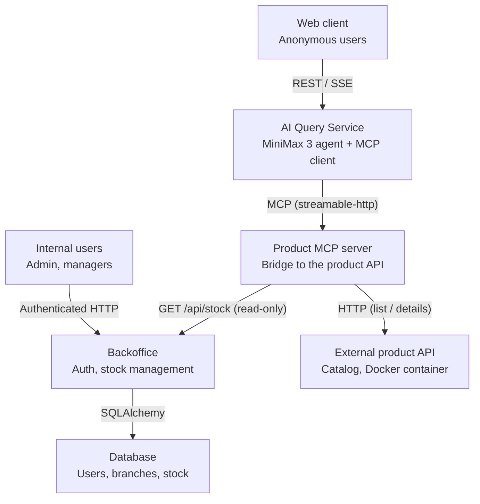
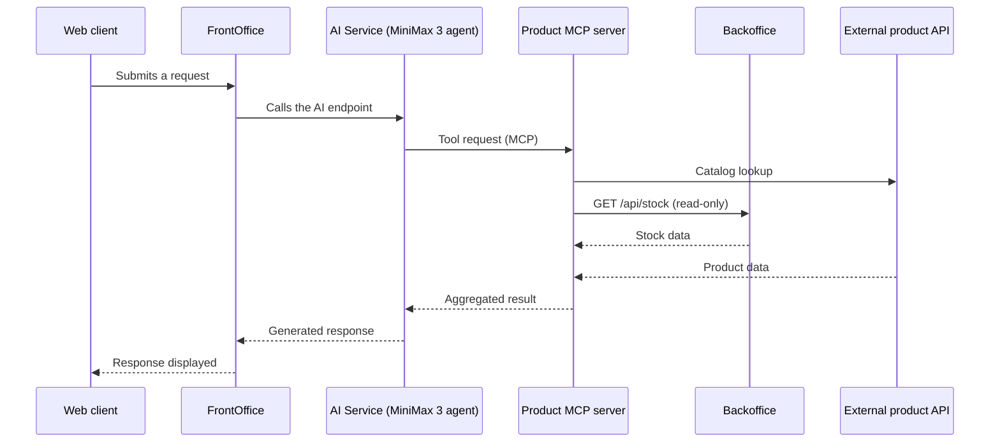

# Holberton Inventory

## Summary


<details>
<summary><b>Table of Contents (Click to expand)</b></summary>

- [Summary](#summary)
- [How to install and run](#how-to-install-and-run)
  - [Prerequisites](#prerequisites)
  - [1. Downloading](#1-downloading)
  - [2. Compiling](#2-compiling)
- [How to use](#how-to-use)
  - [Starting program](#starting-program)
  - [Usage overview](#usage-overview)
- [Features and limitations](#features-and-limitations)
  - [Supported (v1.0)](#supported-v10)
  - [Not supported (yet)](#not-supported-yet)
  - [Accessible help](#accessible-help)
- [Examples of use](#examples-of-use)
  - [Valid examples](#valid-examples)
  - [Failing examples](#failing-examples)
- [Technical information](#technical-information)
  - [General architecture](#general-architecture)
  - [Process Flow](#process-flow)
  - [Memory management](#memory-management)
- [Testing](#testing)
- [Project constraints and methodology](#project-constraints-and-methodology)
  - [Imposed constraints](#imposed-constraints)
    - [Allowed Functions and System Calls](#allowed-functions-and-system-calls)
    - [Requirements](#requirements)
  - [Project methodology](#project-methodology)
  - [Acknowledgments](#acknowledgments)
- [Technologies Used](#technologies-used)
- [Authors](#authors)
- [License](#license)
# Holberton Inventory - A proof-of-concept of full-fledged application


## How to install and run

### Prerequisites

- Docker and Docker Compose installed
- A `.env` file with the required connection variables (database, AI model API key, etc.) — *FIXME: list the exact expected variables*

### Installation

```bash
git clone <repo-url>
cd <repo-name>
docker compose up --build
```

This command starts all the containers: the MariaDB database, the external product API, the BackOffice, the FrontOffice, and the AI Service.

*FIXME: specify any database configuration/migration steps needed before the first run.*

## How to use

### Starting program

Once the containers are running, the application is accessible via:
- the BackOffice HTML interface, for internal users (admin / managers)
- the FrontOffice interface, for anonymous customers, which triggers the AI agent when the submit button is clicked


### Usage overview

The customer submits a request through the FrontOffice; it is forwarded to the AI Service, which relies on an agent (MiniMax 3) querying an MCP server to fetch product/stock information from the BackOffice and the external product API, then returns a response to the customer.

On the BackOffice side, internal users manage stock (CRUD) via the HTML interface or the dedicated REST API, with real-time updates pushed to other sessions via Server-Sent Events.

For concrete examples, see [Examples of use](#examples-of-use).

## Features and limitations

As this project was built under tight time constraints and with a pedagogical focus first, it remains intentionally simple in scope.

### Supported (v1.0)

- Per-branch stock management (viewing, updating) with a non-negative quantity constraint
- Internal user authentication with two roles: `admin` and `manager`
- Product lookup by an AI agent (MiniMax 3) via a dedicated MCP server
- Real-time stock updates on the BackOffice side via Server-Sent Events
- Product catalog lookup via a containerized external API


## Accessible help

(optional built-in documentation)*

### General architecture

The project is built around three main components:

- **BackOffice** — the sole source of truth for product and stock knowledge, for both internal users (HTML interface) and the AI agent. Relies on an ORM interface for CRUD operations, an HTTP client to the external product API, and an HTTP server exposing HTML pages, REST endpoints, and an SSE stream.
- **FrontOffice** — the sole entry point for anonymous visitors; it never talks directly to the BackOffice, only through the AI Service.
- **AI Service** — the bridge between the FrontOffice and the BackOffice, combining an AI agent (MiniMax 3) and an MCP server that provides the tools needed to query product/stock information.



### Process Flow



For a deeper dive into the design choices, see the dedicated [Architecture](#) page.


### Testing

For detailed instructions on how to run our manual and automated test suites, please refer to our [Testing Guide](./TESTING.md).

## Project constraints and methodology

### Imposed constraints

This project was carried out in compliance with all business specifications and technical constraints detailed in the project context.

### Requirements

Confer `PROJECT.md`.

### Project methodology

To share a common vision and limit conflicts when pushing code, we applied a few simple rules throughout the project:

- Starting with an architecture flowchart to understand the overall structure and identify potential challenges early on.
- From the start of coding, never pushing directly to `dev`: every feature went through a Pull Request from a personal branch, reviewed and approved by the other teammate — allowing a fresh set of eyes on the code and a natural understanding of each other's work.
- Testing features as they were coded.
- Regularly reintegrating changes pushed to `dev` back into the personal branch, to keep the history as linear as possible and avoid conflicts down the road.
- Occasional use of GitHub Issues and Wiki, which turned out to be unnecessary once our collaboration workflow was running smoothly.
- Main tools: Git and Visual Studio Code / Kate for writing and sharing code; occasionally [codeshare.io](https://codeshare.io/) and [onlinegdb.com](https://www.onlinegdb.com/online_c_compiler) for brainstorming and online testing.

## Acknowledgments

- Holberton School for the project guidelines
- All peer reviewers and testers: Barat Erwan, Lacôte Laurent, Lages Yoann

## Technologies Used

- Python
- FastAPI
- FastMCP
- HttpX
- SQLAlchemy
- MiniMax 3 (AI agent)
- MariaDB
- Docker / Docker Compose
- Git / GitHub


## Authors

- Lacôte Laurent - [GitHub](https://github.com/llacote-holberton)
- Lages Yoann - [GitHub](https://github.com/Yo13038)

## License

This project is part of the Holberton School curriculum and is made available under the General Public License v3.0, confer [License text](./LICENSE.md) for details
